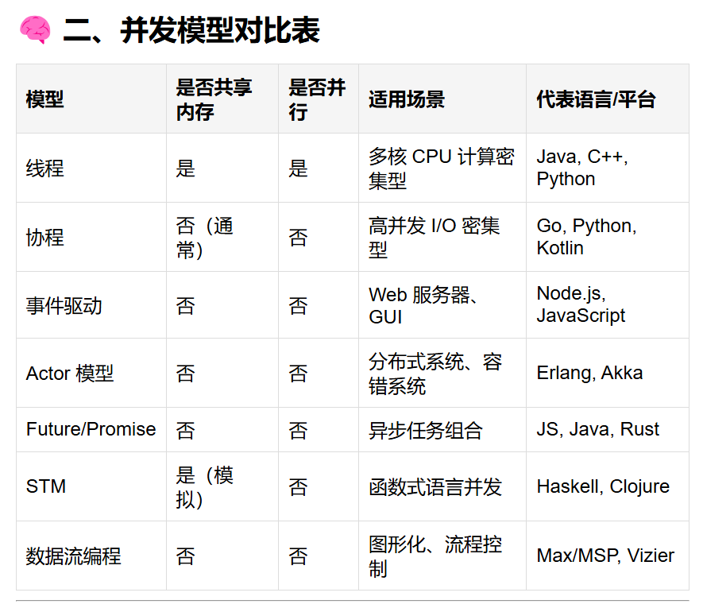

# 一、多线程
## 为什么要用多线程？
- 提高单CPU利用率。
    > 线程A等待IO响应时，切换到线程B执行其他操作。
- 提高多CPU或CPU内核利用率。
    > 多线程可额外利用空闲的CPU或内核。
- 交替响应用户不同请求，提供更好的用户体验。
    > 如果IO耗时线程不切换，UI可能卡死（可用background线程执行）
- 提高客户端间公平性。
    > client1访问server执行时，client2访问server需要等client1结束才能执行，造成不平等。

**多CPU多线程图示**

## 多线程问题
可能遇到下面两种多线程访问共享资源的情况：
1. Thread1读取内存地址1，Thread2写入内存地址1.
Thread1读取后Thread2写入 or Thread2写入后Thread1读取，结果是不一样的。
2. Thread1写入内存地址1，Thread2写入内存地址1.
两个写入先后顺序不同，最终内容也不同。

因此，需要能够用程序去控制线程如何正确访问资源（包括内存、数据库、文件等），由此引出并发模型。

## 主流并发模型

# (暂存) 主流并发模型

以下是现代编程语言、操作系统和分布式系统中常用的**主流并发模型**分类与简要说明。

---

## ✅ 主流并发模型一览

| 并发模型         | 核心机制                         | 特点                                                                 |
|------------------|----------------------------------|----------------------------------------------------------------------|
| **线程（Thread）**        | 操作系统级调度，共享内存       | 真正并行，资源开销大，需同步机制                                     |
| **协程（Coroutine）**     | 用户态轻量级任务，协作式切换   | 高效，非抢占式，适合 I/O 密集型任务                                  |
| **事件驱动（Event-driven）** | 异步回调 + 事件循环            | 单线程非阻塞，资源消耗低，容易形成“回调地狱”                         |
| **Actor 模型**          | 消息传递，无共享状态           | 安全性高，易于扩展到分布式系统                                       |
| **Future/Promise**      | 异步结果封装，链式调用         | 易于组合异步操作                                                     |
| **数据流（Dataflow）**  | 数据流动触发计算               | 天然支持并行，结构清晰                                               |
| **软件事务内存（STM）** | 借鉴数据库事务机制             | 避免锁，适合函数式语言                                               |
| **基于 CSP 的通信**     | Channel 通信，顺序化数据访问   | Go 的 goroutine 和 channel 是典型实现                               |

---

## 🧩 各模型详解

### 1. **线程模型（Thread-based Concurrency）**
- **机制**：由操作系统调度，多个线程共享进程内存。
- **优点**：充分利用多核 CPU，并行执行。
- **缺点**：上下文切换代价高，共享内存易引发竞态条件。
- **适用场景**：CPU 密集型任务。
- **代表语言/平台**：Java、C++、Python（GIL限制）

---

### 2. **协程模型（Coroutine-based Concurrency）**
- **机制**：用户态调度，轻量级，非抢占式。
- **优点**：切换成本低，适合大量并发 I/O 操作。
- **缺点**：不能自动利用多核，需要配合线程池。
- **代表语言/平台**：
  - Python（`asyncio`）
  - Kotlin（协程）
  - Go（goroutine，虽然叫法不同，本质是协程+调度器）

---

### 3. **事件驱动模型（Event-driven / Callback）**
- **机制**：通过事件循环监听事件，触发回调处理。
- **优点**：单线程下高效处理 I/O。
- **缺点**：嵌套回调难以维护，“回调地狱”问题。
- **代表语言/平台**：Node.js、JavaScript 浏览器环境

---

### 4. **Actor 模型**
- **机制**：每个 Actor 是独立实体，通过消息通信，不共享状态。
- **优点**：天然避免共享状态问题，适合分布式系统。
- **缺点**：消息丢失、顺序、延迟等问题需处理。
- **代表语言/平台**：Erlang、Akka（JVM）、Orleans（.NET）

---

### 5. **Future/Promise 模型**
- **机制**：将异步操作抽象为一个未来结果对象，支持链式调用。
- **优点**：结构清晰，便于组合多个异步操作。
- **缺点**：错误处理复杂，取消机制较弱。
- **代表语言/平台**：JavaScript（Promise）、Java（CompletableFuture）、Rust（Future）

---

### 6. **数据流模型（Dataflow Concurrency）**
- **机制**：节点间通过数据流连接，数据到达后自动触发计算。
- **优点**：天然并行，适合图形化或流程控制应用。
- **缺点**：设计和调试难度较大。
- **代表语言/平台**：Go 的 `channel`、Vizier、Max/MSP

---

### 7. **软件事务内存（STM, Software Transactional Memory）**
- **机制**：像数据库事务一样管理共享变量访问。
- **优点**：避免显式锁，代码更简洁。
- **缺点**：性能可能不如优化后的锁机制。
- **代表语言/平台**：Haskell（STM）、Clojure（Ref + STM）

---

### 8. **CSP（Communicating Sequential Processes）模型**
- **机制**：强调通过通道（Channel）进行通信，而非共享内存。
- **优点**：结构清晰，通信安全，易于推理并发行为。
- **代表语言/平台**：Go（goroutine + channel）、Occam、Limbo

---

## 🎯 如何选择合适的并发模型？

| 考察维度         | 推荐模型                             |
|------------------|--------------------------------------|
| 多核并行需求     | 线程、Go 的 goroutine                |
| I/O 密集型任务   | 协程、事件驱动、Future/Promise       |
| 分布式系统       | Actor 模型                           |
| 共享状态管理困难 | STM、Actor、CSP                      |
| 图形界面或网络服务 | 事件驱动、协程                       |
| 可读性和维护性   | 协程（如 async/await）、Promise      |

---